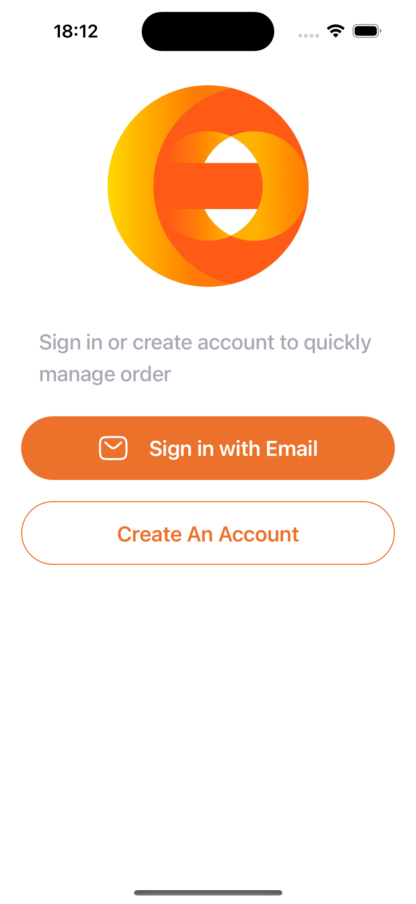
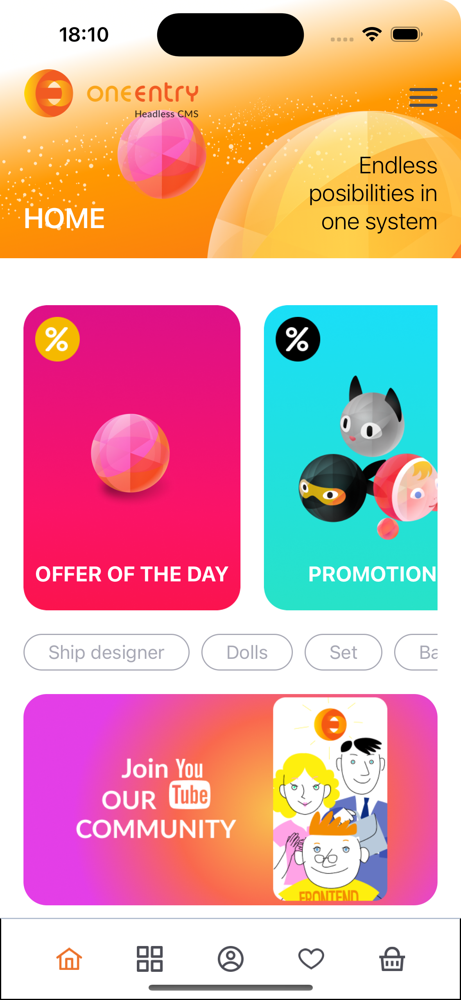
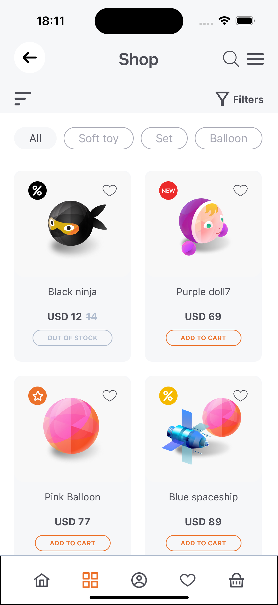

# OneEntry: Shopping online on React native

This mobile application showcases the capabilities of the [OneEntry CMS][oneentry]. We have built an online store entirely using the OneEntry CMS on the [React Native][rn] platform. In this application, you will find the use of all the functional features of OneEntry, available on both Android and iOS thanks to the cross-platform nature of React Native.

This app provides a fully immersive shopping experience with all essential e-commerce features. Start by registering for an account, and dive into a comprehensive, flexible catalog of products complete with powerful search options, extensive filtering, and organizational tools. Users can add products to their favorites and cart, with state managed on the server to support consistency across sessions.

## Features
All interactions with the OneEntry CMS in this application are powered by the [OneEntry SDK for JavaScript][oneentry-sdk], ensuring seamless integration and efficient data handling. Additionally, most of the app's content is editable directly through the CMS, providing flexibility and enabling easy updates without needing app-level changes. This approach leverages the powerful content management features of OneEntry to support a dynamic, customizable user experience.

This application is built using the [Expo framework][expo], allowing for streamlined development across both iOS and Android platforms. For optimal functionality, the app is configured to work with **Expo Prebuild**. The layout leverages Tailwind CSS (via [NativeWind][nativewind]) to ensure a modern and responsive design across devices. Push notifications built in for both platform and can be sent and customized directly from the OneEntry CMS.


### Core Features
- **User creation:** Register users via different providers (email, phone) and customize which data to store.
- **User Activation:** Activate users via code, such as through email verification.
- **State Management:** Utilize Redux Toolkit and Server state for effective state management.
- **Efficient Store Catalog:** Easily manage an unlimited number of products in the catalog.
- **Dynamic Catalog Updates:** Reload the catalog, with direct editing capabilities in the CMS.
- **Advanced Filtering:** Apply a variety of filters to the product catalog for better organization and search.
- **Editable Block Content:** Support for user-editable block content.
- **Product Recommendations:** Display various selections of products.
- **Feedback Forms:** Include customizable feedback forms with captcha protection to prevent spam.
- **Order Creation and Purchases:** Complete transactions using [Stripe][stripe] for secure, seamless payments. 
- **Order History:** View past purchases and maintain a record of all transactions.
- **Event Notifications:** Leverage events to notify users of updates, offers, or important news in real-time.
- **TypeScript Integration:** The project is beginner-friendly and uses lightweight TypeScript for development.
- **Tailwind:** User-friendly layout comprehensible to everyone.

## Project overview

### Screenshots

|               Registration                |               Home                |               Catalog                |
|:-----------------------------------------:|:---------------------------------:|:------------------------------------:|
|  |  |  |

### Important files and folders

| File(s)           | Description                                    |
|-------------------|------------------------------------------------|
| `.env`            | OneEntry CMS project configuration             |
| `/src/api`        | API, methods and hooks definition              |
| `/src/components` | Components of the app                          |
| `/src/navigation` | App navigation management via React-navigation |
| `/src/pages`      | Screens of the app                             |
| `/src/providers`  | React contexts and providers                   |
| `/src/store`      | Redux-Toolkit management and core reducers     |
| `/src/types`      | Types for TypeScript                           |
| `/src/ui`         | UI components of the app                       |
| `/src/utils`      | Useful utils                                   |


## Configuration

### Step 1. Set up the project

Open the `.env` file and fill the variables with your project data

Configure push notifications. Add `google-services.json` and `GoogleService-Info.plist` files to project root. Detailed instruction for Push Notifications setup you can see in our [Documentation][doc-push].

Configure `app.json`. 

### Step 2. Install dependencies

Install project dependencies using **yarn**.
```bash 
yarn install
```

To verify your project is set up correctly, use the following Expo command:
```bash 
npx expo-doctor
```
This will identify any configuration issues and ensure your environment is properly configured for development.

To run the app with Expo Prebuild, use the following commands:
>**Note**: This app requires native dependencies and will not work with Expo Go.

**Android:**
```bash
npx expo run:android
```
**iOS:**
```bash
npx expo run:ios
```

Running the app with Expo Prebuild will create dedicated android and ios folders in your project for native code.

If you prefer to avoid managing native code, consider using [Expo Application Services (EAS)][eas], which allows for custom builds without needing direct access to these native folders.

After completing all these steps, your app should run correctly. If you encounter any issues, we've created a guide to help you troubleshoot common errors.

## Error handling
First, try running doctor with the following command to check for any issues:
```bash 
npx expo-doctor
```

If you encounter **errors with Firebase** during an Android build, try updating the `<meta-data>` tags in your `AndroidManifest.xml` as follows:

Replace:
```bash 
<meta-data android:name="com.google.firebase.messaging.default_notification_channel_id" android:value="default"/>
<meta-data android:name="com.google.firebase.messaging.default_notification_color" android:resource="@color/notification_icon_color"/>
<meta-data android:name="com.google.firebase.messaging.default_notification_icon" android:resource="@drawable/notification_icon"/>
```

with:
```bash
<meta-data tools:replace="android:value" android:name="com.google.firebase.messaging.default_notification_channel_id" android:value="default"/>
<meta-data tools:replace="android:resource" android:name="com.google.firebase.messaging.default_notification_color" android:resource="@color/notification_icon_color"/>
<meta-data tools:replace="android:resource" android:name="com.google.firebase.messaging.default_notification_icon" android:resource="@drawable/notification_icon"/>
```

For iOS, ensure you are using the latest version of Xcode and iOS.

In case of any issues or questions, you can post:
[GitHub discussion for React Native][discussion]


[oneentry]: https://oneentry.cloud/
[rn]: https://reactnative.dev
[oneentry-sdk]: https://www.npmjs.com/package/oneentry
[discussion]: https://oneentry.cloud/
[expo]: https://expo.dev/
[nativewind]: https://www.nativewind.dev/
[stripe]: https://stripe.com/
[eas]: https://expo.dev/eas
[doc]: https://doc.oneentry.cloud/
[doc-push]: https://doc.oneentry.cloud/docs/events/introduction
