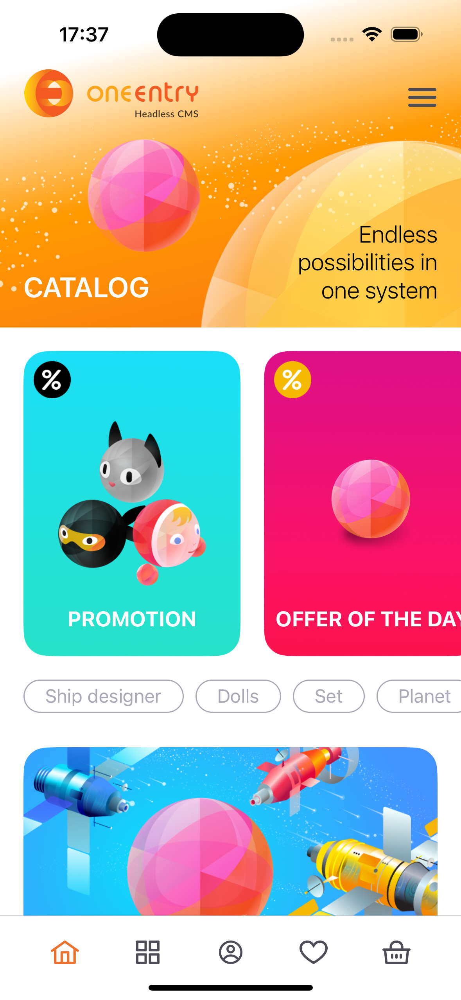
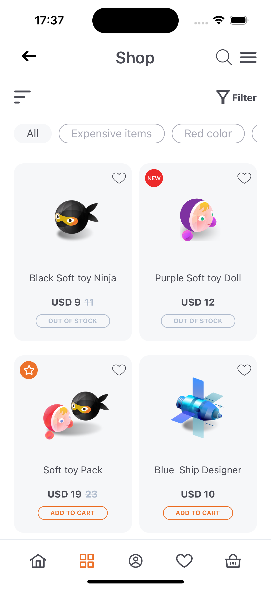
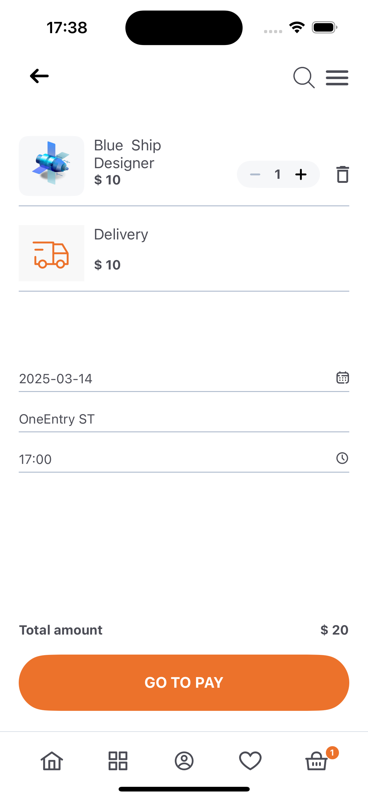
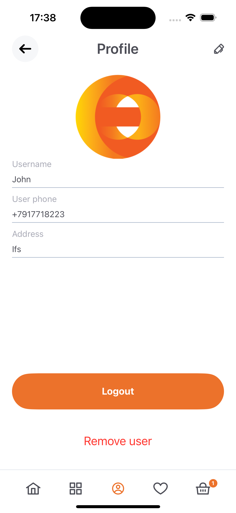
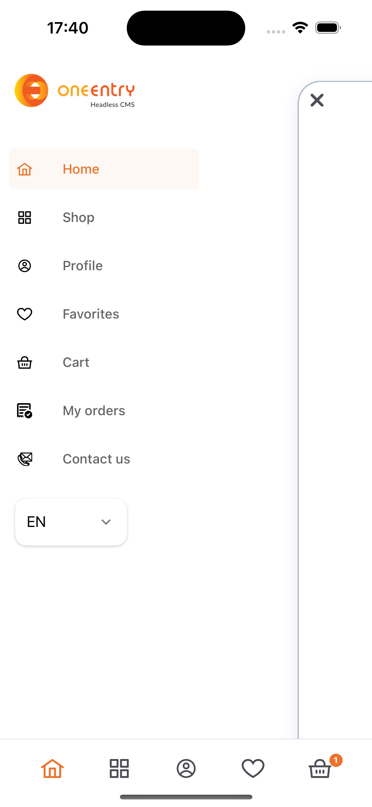

<p align="center">
    
</p>

<h1 align="center">
  OneEntry: Shopping online on React native
</h1>

 

## Table of Contents

1. [Project Overview](#project-overview)
2. [Features](#features)
3. [Architecture](#architecture)
4. [Configuration](#configuration)
5. [Error handling](#error-handling)
6. [Detailed docs](#detailed-docs)
---
## Project overview

This mobile application📱 showcases the capabilities of the [OneEntry CMS][oneentry] with [React Native][rn]. 
All app data is sourced from OneEntry. You can customize it to meet your requirements by modifying in the CMS. 
In this application, you will find the use of all the functional features of OneEntry, fully available on both Android and iOS.

This app provides a fully immersive shopping experience with all essential e-commerce features. Start by registering for an account, and dive into a comprehensive, flexible catalog of products complete with powerful search options, extensive filtering, and organizational tools. Users can add products to their favorites and cart, with state managed on the server to support consistency across sessions.

<div style="display: flex; gap: 1px; overflow: hidden;">
  <div style="flex: 1; height: 270px; overflow: hidden;">
    
    <p style="text-align: center; font-size: 12px;">Masters</p>
  </div>
  <div style="flex: 1; height: 270px; overflow: hidden;">
    
    <p style="text-align: center; font-size: 12px;">Services</p>
  </div>
  <div style="flex: 1; height: 270px; overflow: hidden;">
    
    <p style="text-align: center; font-size: 12px;">Booking</p>
  </div>
    <div style="flex: 1; height: 270px; overflow: hidden;">
    
    <p style="text-align: center; font-size: 12px;">Booking</p>
  </div>
    <div style="flex: 1; height: 270px; overflow: hidden;">
    
    <p style="text-align: center; font-size: 12px;">Booking</p>
  </div>
</div>

## Features

All interactions with the OneEntry CMS in this application are powered by the [OneEntry SDK for JavaScript][oneentry-sdk], ensuring seamless integration and efficient data handling. Additionally, most of the app's content is editable directly through the CMS.

This application is built using the [Expo framework][expo], allowing for streamlined development across both iOS and Android platforms. For optimal functionality, the app is configured to work with **Expo Prebuild**. The layout leverages Tailwind CSS (via [NativeWind][nativewind]). Push notifications built in for both platform and can be sent and customized directly from the OneEntry CMS and FCM.

- 📝 **User creation:** Register users via different providers (email, phone) and customize which data to store.
- ✅ **User Activation:** Activate users via code, such as through email verification code.
- 🔄 **State Management:** Utilize Redux Toolkit for effective state management.
- 🛒 **Efficient Shop Catalog:** Easily manage an unlimited number of products in the catalog.
- 🔍 **Advanced Filtering:** Apply a variety of filters to the product catalog for better organization and search.
- 💡 **Product Recommendations:** Display various selections of products.
- 🖼️ **Block Content:** Using entities of the "Block" type from CMS.
- 📋 **Feedback Forms:** Include customizable feedback forms with captcha protection to prevent spam.
- 💳 **Order Creation and Purchases:** Complete transactions using [Stripe][stripe] for secure, seamless payments.
- 📜 **Order History:** View past purchases and maintain a record of all transactions.
- 📬 **Event Notifications:** Allow users to subscribe to events via email, push notifications, and WebSocket.
- 🚀 **TypeScript Integration:** The project is beginner-friendly and uses lightweight TypeScript for development.
- 🎨 **Tailwind:** User-friendly layout comprehensible to everyone.

## Architecture

| File(s)                                              | Description                                           |
|------------------------------------------------------|-------------------------------------------------------|
| `.env`                                               | OneEntry CMS project configuration                    |
| `/src/defineApi`                                           | API methods and hooks definition                      |
| `/src/components`                                    | Components used **directly on pages**                 |
| &nbsp;&nbsp;├─ `/auth`                               | Components for **auth pages** (login, registration)   |
| &nbsp;&nbsp;├─ `/content`                            | Components for **content pages** (order creation, etc.) |
| &nbsp;&nbsp;│&nbsp;&nbsp;└─ `PrepareOrderScreen`     | Components for the order preparation screen           |
| &nbsp;&nbsp;├─ `/shared`                             | Reusable components used across **multiple pages**    |
| &nbsp;&nbsp;└─ `/ui`                                 | Generic UI elements (buttons, modals, inputs, etc.)   |
| `/src/hooks`                                         | Custom hooks                                          |
| &nbsp;&nbsp;├─ `/auth`                               | Hooks for authentication logic                        |
| &nbsp;&nbsp;├─ `/content`                            | Hooks for content manipulation                        |
| &nbsp;&nbsp;│&nbsp;&nbsp;└─ `PrepareOrderScreen`     | Hooks for order preparation logic                     |
| &nbsp;&nbsp;└─ `/shared`                             | Universal hooks used across the app                   |
| `/src/pages`                                         | Application screens                                   |
| &nbsp;&nbsp;├─ `/auth`                               | Authentication screens (login, registration, etc.)    |
| &nbsp;&nbsp;├─ `/content`                            | Content display/editing screens                       |
| &nbsp;&nbsp;│&nbsp;&nbsp;└─ `PrepareOrderScreen.tsx` | Example page                                          |
| &nbsp;&nbsp;└─ `/shared`                             | Shared page components (headers, footers, layouts)    |
| `/src/navigation`                                    | React Navigation configuration                        |
| `/src/state`                                         | Redux Toolkit slices and core reducers                |
| `/src/types`                                         | TypeScript types                                      |
| `/src/utils`                                         | Helper functions/constants                            |

### Key Principles

#### **Separation of Concerns**
- **Auth-related** and **content-related** logic/components are strictly separated to avoid ambiguity.
- **Pages** (`/src/pages`) act as layout containers with minimal logic, delegating functionality to components.

#### **Component-Driven Design**
- Components are nested under domain-specific folders (e.g., `components/content/PrepareOrderScreen`).
- **Example**:
- PrepareOrderScreen → components/content/PrepareOrderScreen/ItemsInOrderList

#### **Hook Organization**
- **Feature-specific hooks** (e.g., `usePrepareOrderData`) are colocated with their components:
- hooks/content/PrepareOrderScreen/usePrepareOrderData
- **Shared hooks** (universal logic) live in `hooks/shared/`.

#### **Shared Resources**
- Reusable components/hooks are isolated in `/shared` folders (e.g., `components/shared/Rating`).

## Configuration

### Step 1. Set up the project

Open the `.env` file and fill the variables with your project data

Configure push notifications. Add `google-services.json` and `GoogleService-Info.plist` files to project root. Detailed instruction for Push Notifications setup you can see in our [Documentation][doc-push].

Configure `app.json`.

### Step 2. Install dependencies

Install project dependencies using **yarn**.

```bash
yarn install
```

To verify your project is set up correctly, use the following Expo command:

```bash
npx expo-doctor
```

This will identify any configuration issues and ensure your environment is properly configured for development.

To run the app with Expo Prebuild, use the following commands:

> **Note**: This app requires native dependencies and will not work with Expo Go.

**Android:**

```bash
npx expo run:android
```

**iOS:**

```bash
npx expo run:ios
```

Running the app with Expo Prebuild will create dedicated android and ios folders in your project for native code.

If you prefer to avoid managing native code, consider using [Expo Application Services (EAS)][eas], which allows for custom builds without needing direct access to these native folders.

After completing all these steps, your app should run correctly. If you encounter any issues, we've created a guide to help you troubleshoot common errors.

## Error handling

First, try running doctor with the following command to check for any issues:

```bash
npx expo-doctor
```

If you encounter **errors with Firebase** during an Android build, try updating the `<meta-data>` tags in your [AndroidManifest.xml](./android/app/src/main/AndroidManifest.xml) as follows:

Replace:

```bash
<meta-data android:name="com.google.firebase.messaging.default_notification_channel_id" android:value="default"/>
<meta-data android:name="com.google.firebase.messaging.default_notification_color" android:resource="@color/notification_icon_color"/>
<meta-data android:name="com.google.firebase.messaging.default_notification_icon" android:resource="@drawable/notification_icon"/>
```

with:

```bash
<meta-data tools:replace="android:value" android:name="com.google.firebase.messaging.default_notification_channel_id" android:value="default"/>
<meta-data tools:replace="android:resource" android:name="com.google.firebase.messaging.default_notification_color" android:resource="@color/notification_icon_color"/>
<meta-data tools:replace="android:resource" android:name="com.google.firebase.messaging.default_notification_icon" android:resource="@drawable/notification_icon"/>
```

For iOS, ensure you are using the latest version of Xcode and iOS.

## Detailed docs!

This is the central hub for all documentation. Below are links to specific sections.

#### Authorization
- [Authorization Documentation](./documentations/Authorization.md)
- Covers login, sign-up, token management, and account activation.

#### Orders
- [Orders Documentation](./documentations/OrderFlow.md)
- Details order creation, tracking, and transaction handling.

#### Events
- [Events Documentation](./documentations/Events.md)
- Explains real-time updates and event triggers.

#### State
- [State Documentation](./documentations/UserState.md)
- Describes user state management and synchronization.

---

In case of any issues or questions, you can post:
[GitHub discussion for React Native][discussion]

[oneentry]: https://oneentry.cloud/
[rn]: https://reactnative.dev
[oneentry-sdk]: https://www.npmjs.com/package/oneentry
[discussion]: https://oneentry.cloud/
[expo]: https://expo.dev/
[nativewind]: https://www.nativewind.dev/
[stripe]: https://stripe.com/
[eas]: https://expo.dev/eas
[doc]: https://doc.oneentry.cloud/
[doc-push]: https://doc.oneentry.cloud/docs/events/introduction
