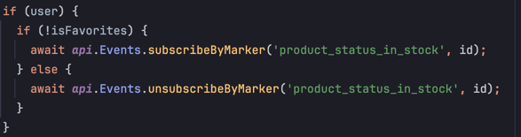
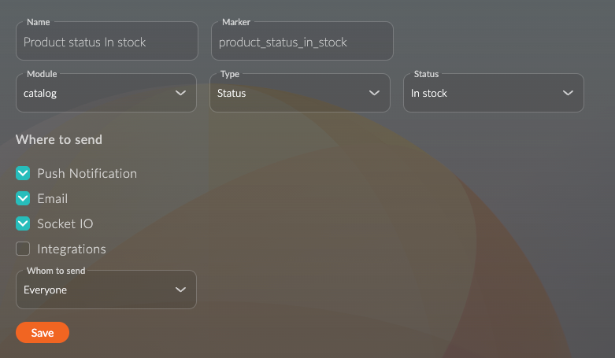

[Back to README](../README.md)
# Events Documentation

## What Are Events?

Events are used to notify users about changes in specific entities or processes. In our application, notifications are delivered via **Push Notifications** and **WebSocket**. Learn more about events: [Events Documentation](https://doc.oneentry.cloud/docs/category/events).

---

## How Events Work

### 1. **Subscription Requirements**
- Some events are subscribed to automatically (e.g., order updates).
- Others require manual subscription via a request to **OneEntry** (e.g., product status changes).

### 2. **Example: Product Subscription**
- When a user adds a product to their favorites in the **[FavoritesButton]** component, they are automatically subscribed to an event that notifies them when the product becomes available.
- **Screenshot**:  
    

- **CMS Configuration**:  
  The event is configured in the CMS to trigger notifications based on specific conditions.  
  **Screenshot**:  
    

---

## Handling Notifications

- **Push Notifications**:
    - Handled by the **[useNotifications]** hook, which is called in the **[AuthContext]**.
    - This ensures that push notifications are processed consistently across the application.

- **WebSocket Notifications**:
    - Handled by the **[useWebSocket]** hook.
    - This hook listens for real-time updates and triggers appropriate actions in the app.

[useNotifications]: ../src/hooks/shared/useNotifications.ts
[useWebSocket]: ../src/hooks/shared/useWebSocket.ts
[AuthContext]: ../src/state/contexts/AuthContext.tsx
[FavoritesButton]: ../src/components/shared/FavoritesButton.tsx

